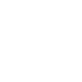
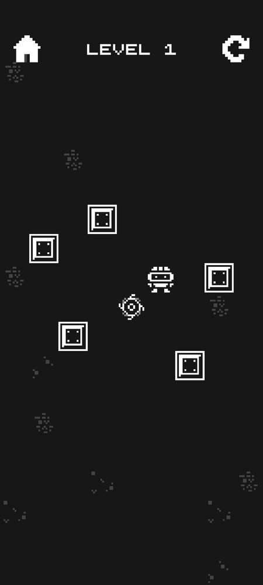
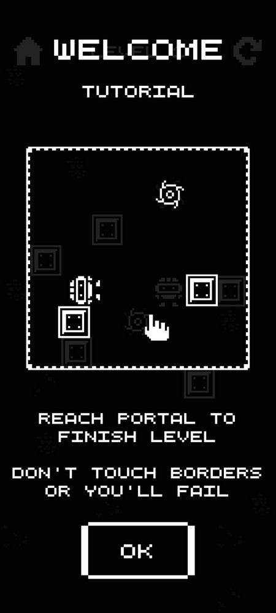
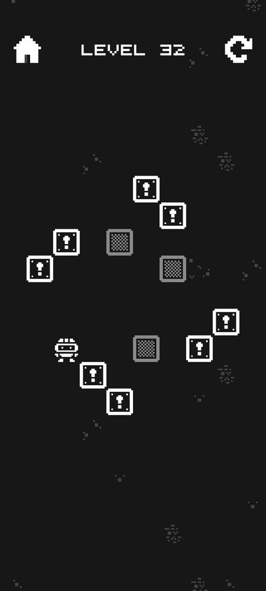

<br />
<p align="center">
   <a href="https://github.com/StarPandaBeg/BlockPath">
    
   </a>

   <h3 align="center">BlockPath - Puzzle Game</h3>

   <p align="center">
    🧩 A little puzzle where you have to navigate through different blocks to pass levels 🎲
   </p>

   <p align="center">
    <a href="https://starpandax.itch.io/blockpath">🎮 Play on itch.io ✨</a>
   </p>
</p>

---

<div align="center">
  
  
  
</div>
<br />
<p align="center">
✨ This is a simple grid-based puzzle game, containing <b>50 levels</b> with different blocks & challenges. <i>Can you beat all of them?</i> 😊
</p>

# Getting started

### Play game

<a href="https://starpandax.itch.io/blockpath">Play Online</a> WebGL version

- or: Download `.apk` file on <a href="https://starpandax.itch.io/blockpath/purchase">itch.io</a> page

### Build

1. Clone the repo
    ```bash
    git clone https://github.com/StarPandaBeg/BlockPath.git
    ```
2. Open Project in **Unity 2022.3.13f1** or later
3. Configure & Build project

# License

Distributed under the MIT License.  
See `LICENSE` for more information.

# Disclaimer

I would appreciate your feedback and suggestions for improvement. Thanks! 💗